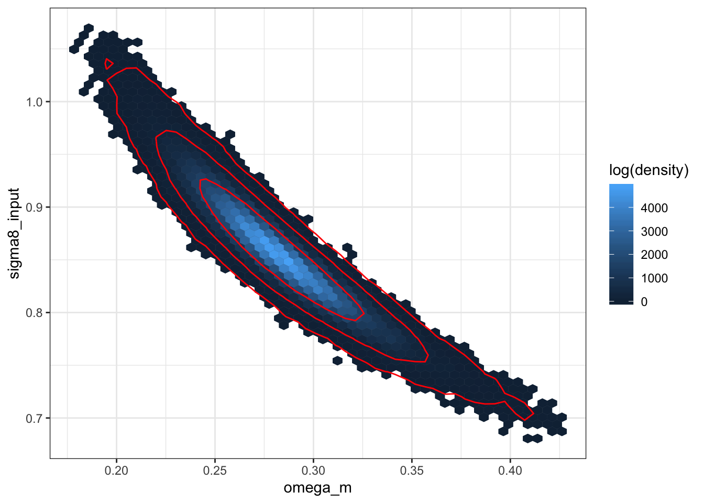
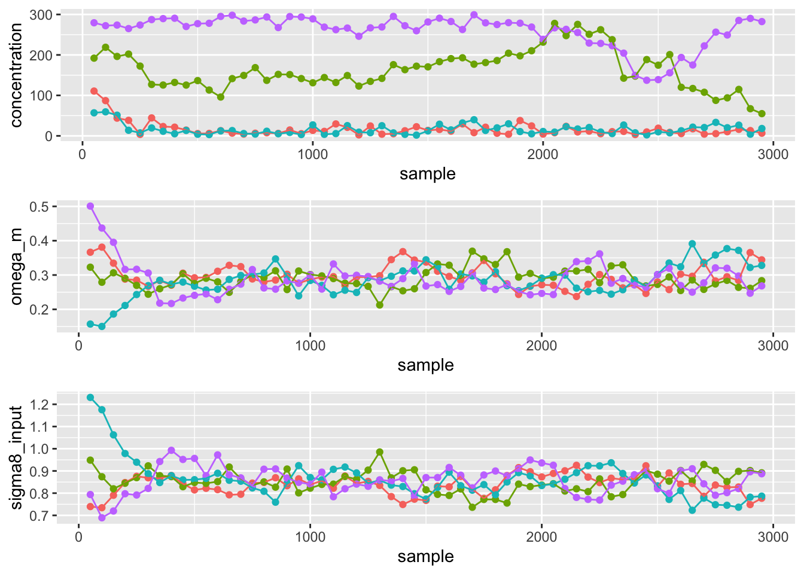
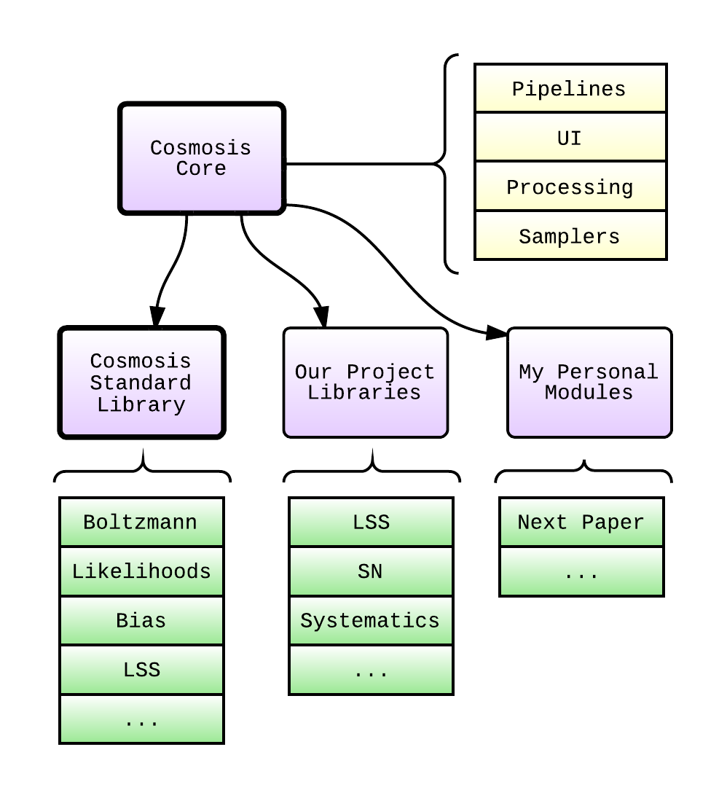
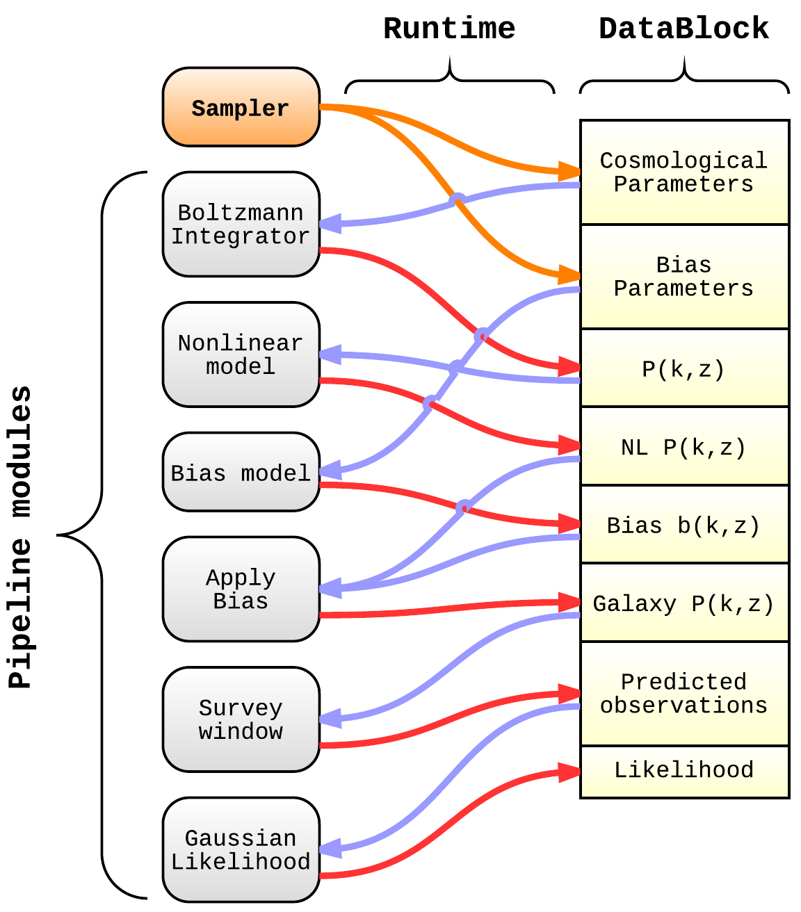
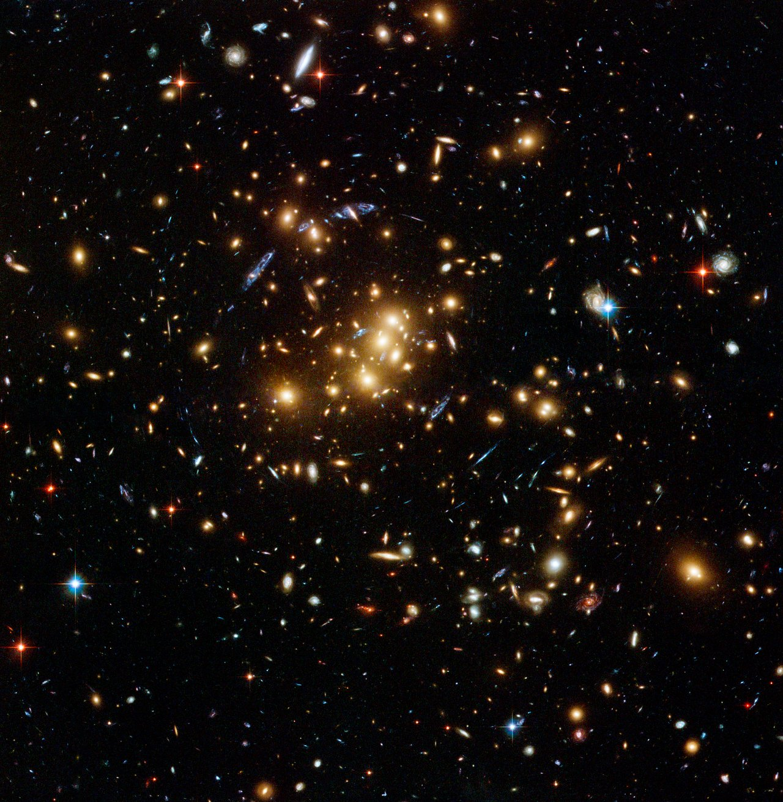
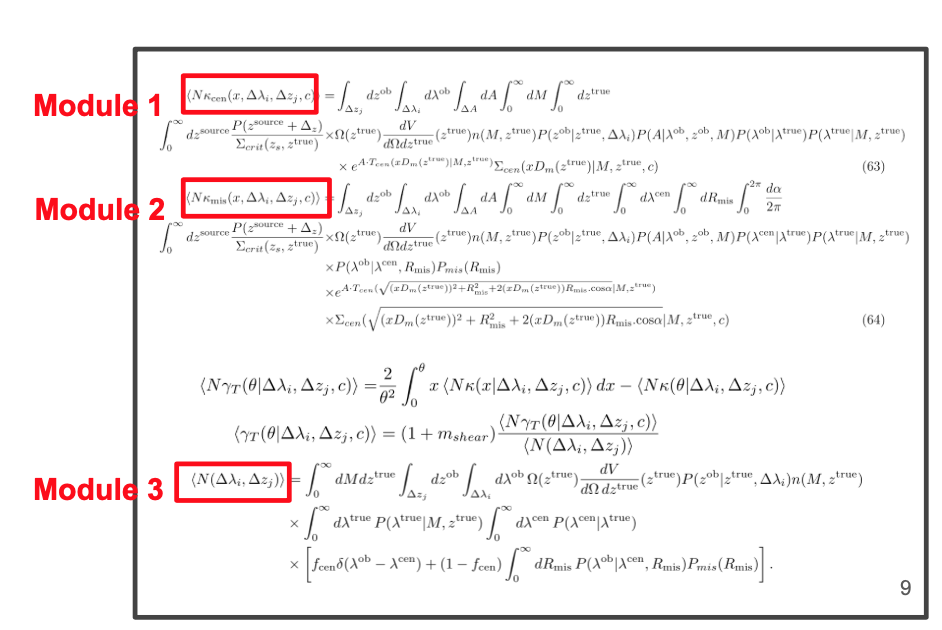

```{r, setup, include = FALSE, echo = FALSE}
knitr::opts_chunk$set(echo = FALSE,
                      fig.height = 4,
                      fig.width = 7.5,
                      fig.align = 'center',
                      out.width = '0.9\\textwidth')
library(tidyverse)
library(magrittr)
theme <- theme_light()
theme$panel.spacing.x <- grid::unit(10.0, units = "points")
theme$plot.margin     <- rep(grid::unit(10.0, units = "points"), 4)
```

## What is CosmoSIS for?

::: columns
:::: {.column width=50%}

* CosmoSIS is a modular Markov Chain Monte Carlo (MCMC) parameter estimation
  system.

* The *modularity* lies in the user's ability to insert Python, Fortran, C, or
  C++ *modules* into the likelihood calculation.

* Its primary task is to use observed data to constrain the values of parameters in
  physical models, with an emphasis on cosmological models.

::::
:::: {.column width=50%}

::::
:::

## How does CosmoSIS work?

* As a MCMC system, CosmoSIS generates *samples* in the *n*-dimensional
  parameter space of the user's problem, according to the appropriate
  *posterior probability density*.

$$ p(\vec{\vartheta}|D,I) \propto p(D|\vec{\vartheta},I) p(\vec{\vartheta}|I) $$
  
* Typical problems have 2--26 physical parameters $\vec{\vartheta}$ to vary.
* The user-specified models supply the likelihood $p(D|\vec{\vartheta},I)$.
* The user also can specify the priors $p(\vec{\vartheta}|I)$.
* The MCMC technique as implemented in CosmoSIS generates samples of the
  parameters $\vec{\vartheta}$.
* *In the long run* these samples will be generated according to the
  apppropriate posterior density.

## Samples

::: columns
:::: {.column width=45%}
* A typical run may generate of order 10^5^ or more samples.

* The trace plots to the right show how the values of the parameters change
  with sample number for the first 3,000 samples of a 10,000 sample-per-chain
  run.
* This program run used 50 MPI ranks to run 50 chains---for a total of 500,000 samples.
* This means each module in the CosmoSIS program was executed 500,000 times.

::::
:::: {.column width=50%}


::::
:::

## The structure of CosmoSIS

::: columns
:::: {.column width=45%}

::::
:::: {.column width=45%}
* CosmoSIS programs are composed of code from multiple sources.
* The CSL, project libraries, and personal libraries all contribute modules.
* The CosmoSIS core contains samplers and supporting code to make *pipelines* run.
::::
:::

## The CosmoSIS pipeline

::: columns
:::: {.column width=40%}

::::
:::: {.column width=50%}
* A CosmoSIS program runs a single *pipeline*.
* A pipeline starts with one *sampler* (*e.g.* the Metropolis-Hastings sampler).
* A pipeline contains an arbitrary number of *modules*.
* Modules can read from and write to the *DataBlock*.
* One or module modules must calculate a *likelihood*.
::::
:::

## Galaxy cluster analysis: many physical models

::: columns
:::: {.column width=40%}

::::
:::: {.column width=55%}

* Analysis technique: predict the number and distribution of galaxy clusters
  in the universe from fundamental cosmology.
* Previous analyses like this have used simple approximations for many
  astrophysical effects.
* This analysis is using well-motivated mathematical models for many effects.
* Effects to be modeled include:
    * Halo mass function
    * Critical Density
    * Survey area
    * Volume Element
    * Various scaling relations
    * Miscentering
    * ...
::::
:::


## The structure of an integrand

* The models are combined into an *integrand*, with many model parameters to
  be "integrated out". **These are the integrals we want to calculate on the GPU.**
* Many models need to be evaluated at different redshifts ($z$) and at
  different radii ($R$).
    * This is what we refer to as *grid points*.
* The integration also needs to be done over several ranges of parameters
   (different volumes of integration).
* Approximately 300 grid points and 5 volumes of integration are needed for
  the analysis.
* The models are represented as *stateful functions* (classes).
    * Some of the model state is defined once, upon construction.
    * Other parts of the state is set anew for each *sample*.
    * Other parts of the state is different for each *grid point*.
* On each *sample*, about 1500 integrals will be evaluated.

## One example integrand

\newcommand{\lbin}{\Delta\lambda_{i}}
\newcommand{\zbin}{\Delta z_{j}}
\newcommand{\zt}{z^{\text{true}}}
\newcommand{\zs}{z^{\text{source}}}
\newcommand{\zo}{z^{\text{ob}}}
\newcommand{\lt}{\lambda^{\text{true}}}
\newcommand{\lc}{\lambda^{\text{cen}}}
\newcommand{\lo}{\lambda^{\text{ob}}}
\newcommand{\Rm}{R_{\text{mis}}}
\newcommand{\fc}{f_{\text{cen}}}

\begin{align*}
 \left<N\kappa_\mathrm{mis}(r, \lbin,\zbin, c)\right> = & \int_{\zbin}d\zo \int_{\lbin} d\lo\int_{\Delta A} dA \int_0^\infty dM \int_0^\infty d\zt  \int_0^\infty d\lc \int_0^\infty d\Rm  \\
  & \int_{0}^{2\pi} \frac{d\alpha}{2\pi}  \int_0^\infty d\zs \frac{P(\zs+\Delta_z)}{\Sigma_{crit}(z_s, \zt)}  \\
  & \times \Omega(\zt)\frac{dV}{d\Omega d\zt}(\zt) n(M,\zt)  \\
  & \times P(\zo|\zt,\lbin) P(A|\lo,\zo,M) P(\lc|\lt) P(\lt|M,\zt)  \\
  & \times P(\lo|\lc,\Rm)P_{mis}(\Rm) \nonumber \\
  & \times e^{A\cdot T_{cen}(\sqrt{r^2+\Rm^2+2r\Rm. \mathrm{cos}\alpha}|M,  \zt)}  \\
  & \times \Sigma_{cen}(\sqrt{r^2+\Rm^2+2r\Rm. \mathrm{cos}\alpha}|M, \zt, c)
\end{align*}

## Many different models

::: columns
:::: {.column width=65%}

::::
:::: {.column width=35%}
* These are the equations for 3 of the integrands being developed.
* Each of terms in the integrands is a different model.
::::
:::

## A class template for forming integration modules

```{c++}
  template <typename INTEG>
  class CosmoSISScalarIntegrationModule {
  public:
    using IntegrandType = INTEG;
    using volume_t = cubacpp::integration_volume_for_t<IntegrandType>;
    using grid_point_t = typename IntegrandType::grid_point_t;
    using integration_results_t = cubacpp::integration_result;

    explicit CosmoSISScalarIntegrationModule(cosmosis::DataBlock& cfg);

    // Evaluate all the integrals specified (all grid points, and all
    // volumes), and record the results in the sample.
    void execute(cosmosis::DataBlock& sample);
```

